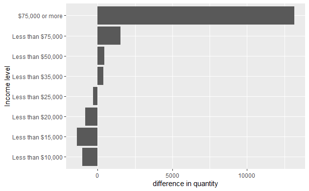

# Artur_project
<html>
<head>
---
title: "Exploring the BRFSS data"
output: 
  html_document: 
    fig_height: 4
    highlight: pygments
    theme: spacelab
---
--
</head>
<body>
<pre style = "word-wrap: break-word; white-space: pre-wrap;">
## Setup

### Load packages

```{r load-packages, message = FALSE}
library(ggplot2)
library(dplyr)
```

### Load data

```{r load-data}
load("brfss2013.RData")
```

* * *

<h2>## Part 1: Data</h2>
<h3>Data & methodological background</h3>
The BRFSS collects unique, country-specific data on preventive health practices and risky behaviors associated with chronic diseases, injuries, and preventive infectious diseases that affect the adult population.
BRFSS conducts a telephone survey.
Interviewers collect data from a randomly selected adult in the household. The health characteristics used to measure BRFSS apply to adults over the age of 18 living in the United States.

I researched the health issues of the US population in 2013.
The results of this study cannot be generalized to another time period, and even more so to another country, due to the fact that the sample is not random.

* * *

<h2>## Part 2: Research questions</h2>

<h3>**Research quesion 1:**</h3>

Compliance with the doctor's requirements is a very important thing in the healing process.
Including for people who have arthritis, and the attending physician prescribed them to play sports in order to avoid the disease. With this study, I would like to study whether people adhere to the doctor's prescribed treatment

<h3>**Research quesion 2:**</h3>
Pregnancy is an important process in the continuation of the human race and humans in particular. And the observance of all conditions for the birth of a healthy child is the key to the healthy development of our future.
With this study, I would like to study how many pregnant women abuse smoking and have hypertension 

<h3>**Research quesion 3:**</h3>
Obesity is a big problem of our time. With my research, I would like to study the dependence of obesity in a person on income.

* * *

<h2>## Part 3: Exploratory data analysis</h2>

<h3>**Research quesion 1:**</h3>

```{r}
#Let's create a dataset where you can see the number of people with arthritis who are offered physical activity by a doctor and these people follow these doctor's recommendations
Paa <- brfss2013 %>% 
  filter(!is.na(X_ageg5yr), arthexer == "Yes", 
         X_totinda == "Had physical activity or exercise") %>%
  group_by(X_ageg5yr, arthexer) %>%
  summarise(count = n())

#Let's create a dataset in which you can see the number of people with arthritis who are offered physical activity by a doctor, but these people are not engaged in physical activity.
PaaPA <- brfss2013 %>% 
  filter(!is.na(X_ageg5yr), arthexer == "Yes") %>%
  group_by(X_ageg5yr, arthexer) %>%
  summarise(count = n())

#let's create a new variable to see the ratio of the number of these groups of people
abc <- Paa$count/PaaPA$count

#Let's create a barplot to see the addiction of people engaged in physical activity and following the doctor's recommendations. It can be concluded that with increasing age, the percentage falls, but it does not fall below 60%, which suggests that most people comply with the doctor's requirements.
barplot(abc, col = "steelblue",
        xlab = "18 years and above ",
        ylab = "Percentage of people")
```


<h3>**Research quesion 2:**</h3>

```{r}
# Let's create a dataset that includes pregnant women who smoke and show signs of hypertension
PB <- brfss2013 %>%
  filter(!is.na(smokday2), pregnant == "Yes", bphigh4 == "Yes") %>%
  group_by(smokday2) %>%
  summarise(count = n())

#Let's create a dataset that includes pregnant women who smoke and do NOT show signs of hypertension
PBN <- brfss2013 %>%
  filter(!is.na(smokday2), pregnant == "Yes", bphigh4 == "No") %>%
  group_by(smokday2) %>%
  summarise(count = n())

#create a new variable that characterizes the ratio of girls from these datasets
PBN <- PBN %>%
  mutate(CPB = PB$count / PBN$count)

#Let's build a diagram where you can see that the ratio of girls with hypertension decreases as the frequency of smoking decreases and smoking cessation
ggplot(data = PBN, aes(x = smokday2, y = CPB)) + geom_col() + 
  geom_text(aes(label = CPB), vjust = -0.5) + 
  xlab("Smoking frequency ") +
  ylab("The ratio of smokers to non smokers")
```


<h3>**Research quesion 3:**</h3>

```{r}
#Let's create a dataset in which we selected people with normal weight and group them by income level
P1 <- brfss2013 %>%
  filter(!is.na(X_bmi5cat), !is.na(income2), X_bmi5cat == "Normal weight") %>%
  group_by(X_bmi5cat, income2) %>%
  summarise(count = n())

#create a dataset in which we have selected obese people and group them by income level
P2 <- brfss2013 %>%
  filter(!is.na(X_bmi5cat), X_bmi5cat == "Obese", !is.na(income2)) %>%
  group_by(X_bmi5cat, income2) %>%
  summarise(count = n())

#add a new column to this dataset, in which we will see the difference between the number of people in these datasets
P2 <- P2 %>%
  mutate(CP = P1$count - P2$count)

# let's create a bar chart. On it we see that starting with an income level of over 35,000, the number of people who have a normal weight increases.
ggplot(data = P2, aes(x = CP, y = income2)) + geom_col() + 
  xlab("difference in quantity") +
  ylab("Income level")
```

<h2>References</h2>
About BRFSS. Accessed from: <a href= 'https://www.cdc.gov/brfss/about/index.htm'>brfss</a>
The BRFSS Data User Guide. Accessed from:<a href='https://www.cdc.gov/brfss/data_documentation/pdf/UserguideJune2013.pdf'>UserguideJune2013.pdf</a>
</pre>
</body>
</html>
